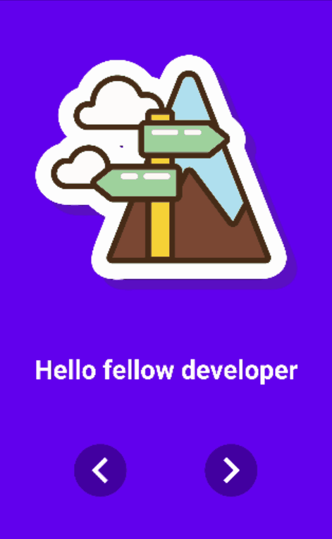

# ConcentricOnboarding
Android Concentric Onboarding library

 [](https://opensource.org/licenses/MIT) [](https://jitpack.io/#Chrisvin/ConcentricOnboarding) [](https://android-arsenal.com/api?level=21) 

|  |  |
| :-: | :-: |
| Slide Mode | Reveal Mode |

ConcentricOnboarding is a viewpager library that can be used to make awesome onboarding designs.

If you like this, you'll like [LiquidSwipe](https://github.com/Chrisvin/LiquidSwipe) as well.

## Demo app
To run the demo project, clone the repository and run it via Android Studio.
</br>(OR)
</br>Download the latest demo apk from [releases](https://github.com/Chrisvin/ConcentricOnboarding/releases).

## Usage
#### Set up the dependency
1. Add the JitPack repository to your root build.gradle at the end of repositories:
```
allprojects {
	repositories {
		...
		maven { url 'https://jitpack.io' }
	}
}
```
2. Add the ConcentricOnboarding dependency in the build.gradle:
```
implementation 'com.github.Chrisvin:ConcentricOnboarding:1.0'
```

#### Use `ConcentricOnboardingViewPager` instead of the normal `ViewPager`
```
<androidx.constraintlayout.widget.ConstraintLayout 
    xmlns:android="http://schemas.android.com/apk/res/android"
    android:layout_width="match_parent"
    android:layout_height="match_parent">

    <com.jem.concentriconboarding.ConcentricOnboardingViewPager
        android:id="@+id/viewpager"
        android:layout_width="match_parent"
        android:layout_height="match_parent"/>

</androidx.constraintlayout.widget.ConstraintLayout>
```

#### Use a `ConcentricOnboardingLayout` as the base container in the fragment layouts
```
<?xml version="1.0" encoding="utf-8"?>
<com.jem.concentriconboarding.layout.ConcentricOnboardingConstraintLayout
    xmlns:android="http://schemas.android.com/apk/res/android"
    xmlns:app="http://schemas.android.com/apk/res-auto"
    xmlns:tools="http://schemas.android.com/tools"
    android:layout_width="match_parent"
    android:layout_height="match_parent"
    tools:context=".DummyFragment">

    <!--  Fill with your views, just like you would in a normal ConstraintLayout  -->

</com.jem.concentriconboarding.layout.ConcentricOnboardingConstraintLayout>

<!--  Also supports ConcentricOnboardingFrameLayout & ConcentricOnboardingLinearLayout  -->
```

### And you're done, easy-peasy. ^_^

## Customization
### Via XML
```
<com.jem.concentriconboarding.ConcentricOnboardingViewPager
    ...
    app:mode="reveal" // Default is slide
    app:scrollerDuration="2000" // Default is 1000
    app:translationXFactor="3" // Default is 2
    app:translationYFactor="0.5" // Default is 0.35
    app:scaleXFactor="0.75" // Default is 0.5
    app:scaleYFactor="0.75" // Default is 0.5
    />
```
### Via Programmatically
```
viewpager.mode = ConcentricOnboardingViewPager.Mode.REVEAL // Default is SLIDE
viewpager.setDuration(3000) // Default is 1000
viewpager.translationXFactor = 1.5f // Default is 2f
viewpager.translationYFactor = 1f // Default is 0.35f
viewpager.scaleXFactor = 2f // Default is 0.5f
viewpager.scaleYFactor = 2f // Default is 0.5f
viewpager.revealCenterPoint = PointF(centerX, centerY) // Default is screen center
viewpager.revealRadius = radius // Default is 0
```

## Creating custom swipe animations

The concept for the `ClipPathProvider` in ConcentricOnboarding is the same as that in the [LiquidSwipe library](https://github.com/Chrisvin/LiquidSwipe) & [EasyReveal library](https://github.com/Chrisvin/EasyReveal) (If you haven't already, then you should really check it out).

You can create your own swipe animation by extending the [ClipPathProvider](https://github.com/Chrisvin/ConcentricOnboarding/blob/master/concentriconboarding/src/main/java/com/jem/concentriconboarding/base/ClipPathProvider.kt) and implementing the `getPath()` method. `getPath()` provides the [Path](https://developer.android.com/reference/android/graphics/Path) for a given *percent* value on the provided *view*.  The path gotten from `getPath()` is then used to clip the view using `canvas.clipPath(path, op)` (The `op` value is provided by the `ClipPathProvider` as well). You can then set your custom [ClipPathProvider](https://github.com/Chrisvin/ConcentricOnboarding/blob/master/concentriconboarding/src/main/java/com/jem/concentriconboarding/base/ClipPathProvider.kt) to your layouts.

## Bugs and Feedback
For bugs, questions and discussions please use the [Github Issues](https://github.com/Chrisvin/ConcentricOnboarding/issues).

## Credits
1. [Cuberto](https://dribbble.com/shots/6654320-Animated-Onboarding-Screens) - Onboarding design inspiration
2. [Alvaro Fabre](https://lottiefiles.com/tomfabre) - Designer of the lottie animations in the demo app

## License
```
MIT License

Copyright (c) 2020 Jem

Permission is hereby granted, free of charge, to any person obtaining a copy
of this software and associated documentation files (the "Software"), to deal
in the Software without restriction, including without limitation the rights
to use, copy, modify, merge, publish, distribute, sublicense, and/or sell
copies of the Software, and to permit persons to whom the Software is
furnished to do so, subject to the following conditions:

The above copyright notice and this permission notice shall be included in all
copies or substantial portions of the Software.

THE SOFTWARE IS PROVIDED "AS IS", WITHOUT WARRANTY OF ANY KIND, EXPRESS OR
IMPLIED, INCLUDING BUT NOT LIMITED TO THE WARRANTIES OF MERCHANTABILITY,
FITNESS FOR A PARTICULAR PURPOSE AND NONINFRINGEMENT. IN NO EVENT SHALL THE
AUTHORS OR COPYRIGHT HOLDERS BE LIABLE FOR ANY CLAIM, DAMAGES OR OTHER
LIABILITY, WHETHER IN AN ACTION OF CONTRACT, TORT OR OTHERWISE, ARISING FROM,
OUT OF OR IN CONNECTION WITH THE SOFTWARE OR THE USE OR OTHER DEALINGS IN THE
SOFTWARE.
```
